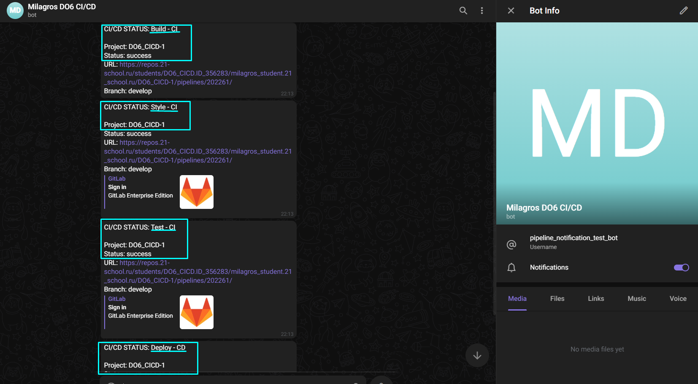

### Part 1. Настройка **gitlab-runner**

1.1 Установка gitlab-runner  

Download 
> curl -LJO "https://gitlab-runner-downloads.s3.amazonaws.com/latest/deb/gitlab-runner_amd64.deb"  
Install:
> dpkg -i gitlab-runner_amd64.deb  
  
  

1.2 Регистрация раннера в gitlab-runner  

> sudo gitlab-runner register  
Добавляем раннеру те теги, что будут использоваться в gitlab-ci.yml (так он сможет приступить к job`е)

Валидируем раннеров    
> sudo gitlab-runner verify  
Проверяем статус службы "gitlab-runner"
> service gitlab-runner status


## Part 2. Сборка

2.1 Создание и конфигурация .gitlab-ci.yml в корне репозитория
> vim .gitlab-ci.yml  
   
Запуск пайп-лайна, запуск раннера
> sudo gitlab-runner run    
Раннер успешно выполнил job по сборке проекта
    


### Part 3. Тест кодстайла

3.1 Добавляем stage для кодстайла в gitlab-ci.yml и пушим в репозиторий.  
    

Проверяем результат работы раннера, как видим - кодстайл не прошёл и зафейлил пайплайн
    
  

Исправляем кодстайл, запускаем проверку вновь.
Кодстайл прошёл успешно, пайплайн завершен.
    
  


### Part 4. Интеграционные тесты

4.1 Добавляет test в gitlab-ci.yml, пушим в репозиторий.  
   

Проверяем результат работы раннера, тест прошёл, пайплайн завершён.
  
  

Попробуем намеренно зафейлить тесты, пайплайн должен прерваться.  
  
  


### Part 5. Этап деплоя

5.1 Клонируем машину
  

5.2 Изменяем файл /etc/netplan/00-installer-config.yaml на обеих машинах:
  

5.3 Изменяем параметры сетевого адаптера на обеих машинах:
   
ping идёт:  
  

5.4 Добавляем этап деплоя в gitlab-ci.yml  
   

5.5 Создаём скрипт copy.sh, который будет передавать файлы через ssh, с помощью утилиты scp (копирование файлов через ssh)
  

5.6 Создадим пользователя gitlab-runner ```sudo su - gitlab-runner```, сгенерируем и скопируем его ssh на вторую машину  
   
> ssh-keygen -t rsa -b 2045  
> ssh-copy-id milagros@10.10.0.2  
   

5.7 Выдадим права на второй машине, для папки `/usr/local/bin/`
> sudo chmod -R 777 /usr/local/bin  
   

5.8 Пушим измененный yml и скрипт copy.sh, пайплайн проходит и ожидает ручного запуска:  
 

5.9 Деплой прошёл успешно, файлы появились в нужной папке на второй машине:  
 


## Part 6. Дополнительно. Уведомления  

6.1 Напишем @botfather, чтобы создать бота и получить его токен:
   

6.2 Добавим по вызову скрипта `notify.sh` после каждой стадии в .yml:
 

6.3 Содержимое скрипта `notify.sh`:  
  

6.4 Оповещения от бота приходят после каждой стадии пайплайна:  
 
